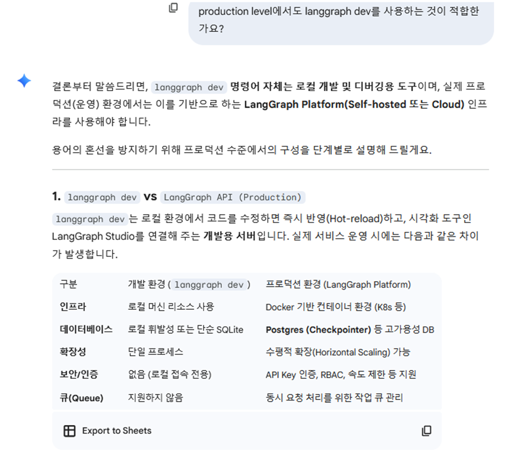
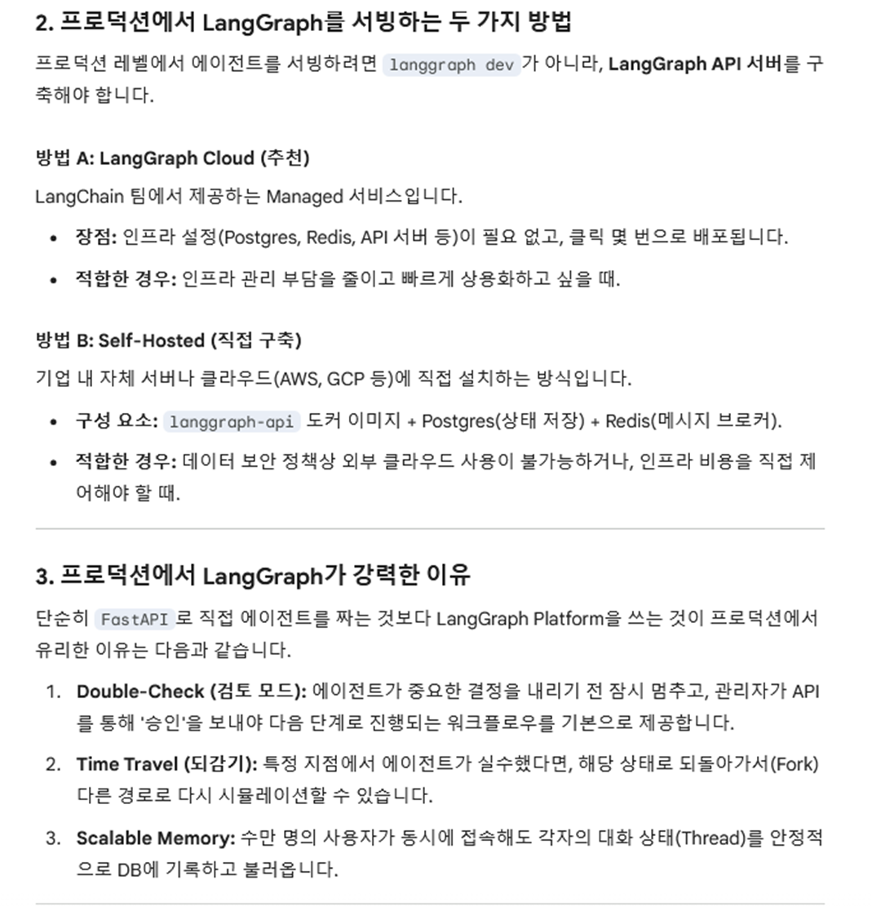

# Agent with Langchain&Langgraph


1. 프론트엔드 실행명령
```bash
cd agent-chat-ui 
pnpm dev
```

2. 백엔드 도커 실행 명령

```bash

# 1. 컨테이너, 볼륨, 네트워크까지 모두 삭제 (이전 작업 완전 삭제 필요시)
docker-compose down -v --remove-orphans

# 볼륨은 유지하면서 컨테이너 삭제
docker-compose down

# 2. 깨끗한 상태에서 다시 실행
docker-compose up -d --build

# 3. 로그 확인
docker-compose logs -f langgraph-api

# 5. API document 
http://127.0.0.1:8123/docs


```

```python
# 단순 개발용 퀵 명령은 
langgraph dev
```


3. langgraph.json 
- langgraph dev 명령시 langgraph.json 세팅에 따라 실행됨
- 아래 예시에서 프론트 연결시 중요한 Graph ID는 "graphs" 안에 있는 "agent" 이다. 
  (소스코드의 구조가 변경되면 langgraph.json 파일도 그에 맞춰서 수정 필요)

```json
{
  "dependencies": ["./agent_code", "."],
  "graphs": {
    "agent": "agent_code.agent:agent"
  },
  "env": ".env"
}
```

## 제선생 참고자료

